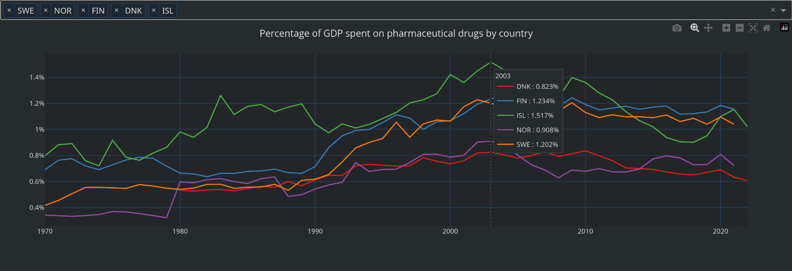

# Pharmaceutical drug spending by country - Web app dashboard
Interactive web app dashboard in which you can choose to display data by selected countries.

The dashboard reads data from an CSV file and is hosted as HTML-based web app. 
User can freely select any number of countries from the dropdown menu to be displayed.
The graphs automatically color each country and follow the same selections.

#### Data sources:
 - [Datahub.io](https://datahub.io/core/pharmaceutical-drug-spending)
